# Launch: 2023-04-09 16:00
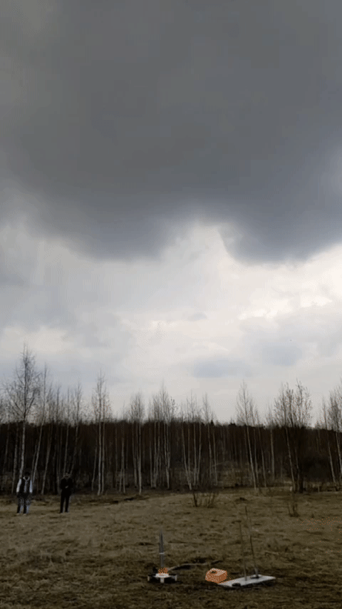

- [Video](https://drive.google.com/file/d/1B62QaeXfHRx_BWN4U88lHAS8USijflbd/view?usp=drive_link)
- [Gallery](https://drive.google.com/drive/folders/17gZx9_EzNpoe8Rtu-Bopn9qgLb-9sY7U?usp=drive_link)

## Characterstics
- Mass = 372 g
- Diameter = 5.0 cm
- Length = 60 cm
- Engine impulse = 30 Ns
- Location: 55.931894, 37.531839
- Height = 210 m
- Range = 100m
- x(C.M) - x(C.P) = 2.5 cm
- No recovery mechanism, intended to impact ground at terminal velocity 

## Engineers
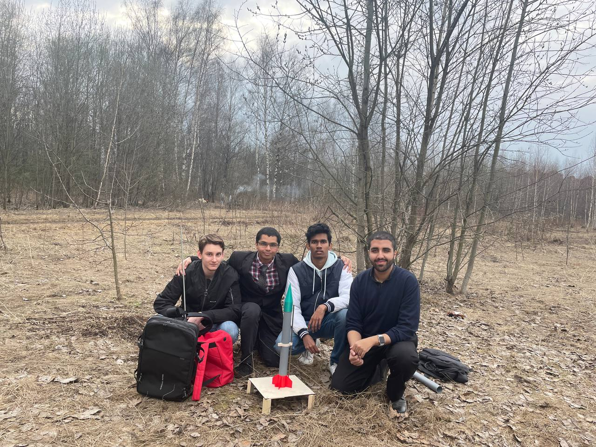

Engineers (left to right in picture):
1. [Alexander](https://vk.com/alexrenat) / __Александр Арутюнян__: purchase of engine, trajectory determination.
1. [Kafi](https://github.com/kafishabbir) / __Кафи Шаббир__: engine holder, tail complex, fin system design, testing and installation.
1. [Bhuvan](https://github.com/Bhuv4nVam5i) / __Бхуван Вамси__: research and calculation of center of pressure, design of ring module.
1. [Reza](https://github.com/rezaaliasgarirenani) / __Реза Алиасгари__: launch pad research-design, manufacturing, lubrication. 

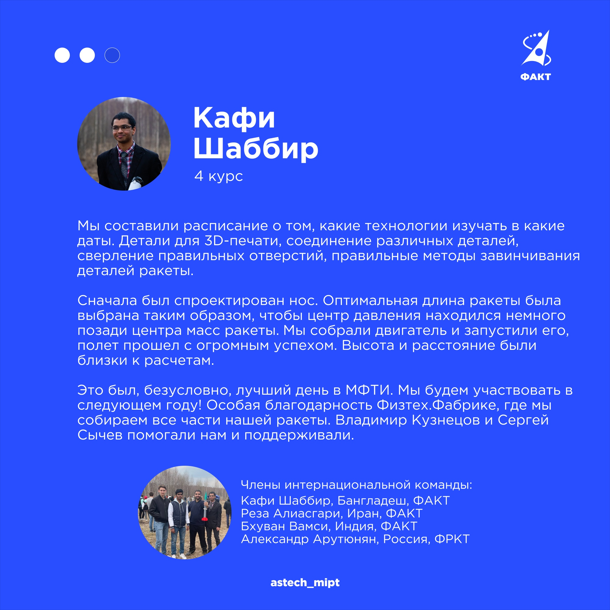
Post on official [VK page](https://vk.com/astech_mipt?z=photo-17906_457246723%2Falbum-17906_00) of MIPT Department of Aerospace

## Notes
### Innovation
- __Olive oil__ to lubricate the launch rod.
- __Engine holder and tail complex__ as one body to minimize the number of parts.
- __Launch pad__ which simply exists to elevate the rocket so that the wires do not touch 

### Fatal Mistakes
- __Chamfering wings__: the tail wings were not chamfered, and after 3D printing one of the wings came out, and it had to be super glued back to place again.

### Modifications for next time
- __Parachute__: RD-1-30-5 has an explosion that occurs 5 seconds after ignition, we had a solid covering of the engine holder. Next time this feature will be used: at least the nose should fly out with a parachute and the body can land separately at terminal velocity.
- __Removal of ring module__: it is difficult to put the the ring module and the tail slider hole parallel to the axis of the rocket. The ring module is to be removed. 

## The rocket
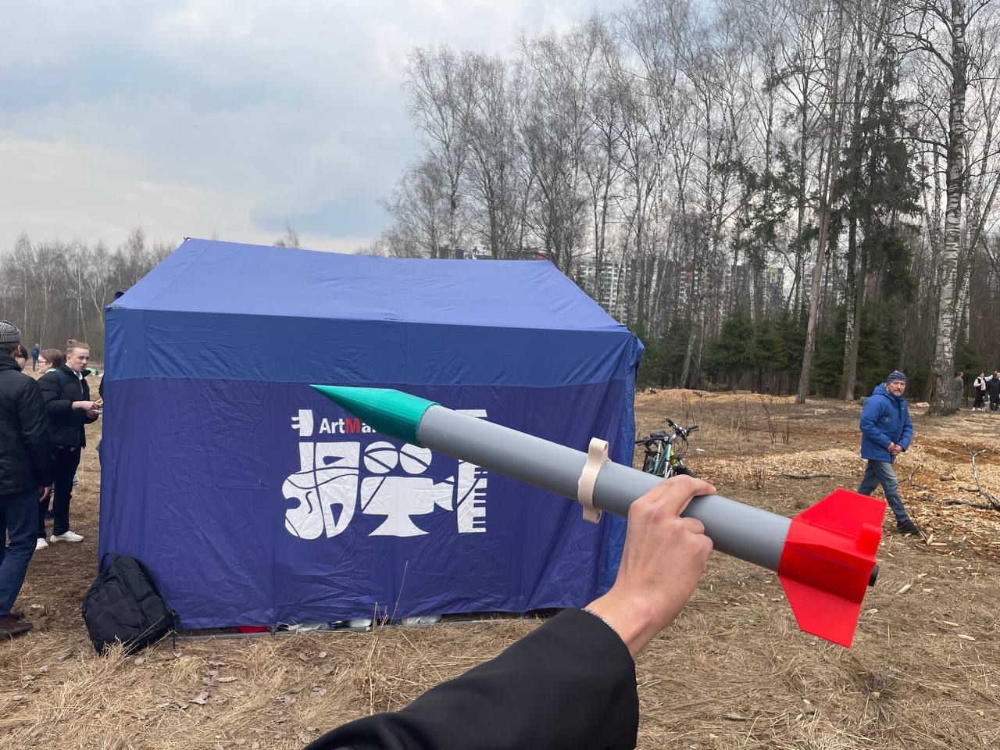

Model display of rocket at launch site

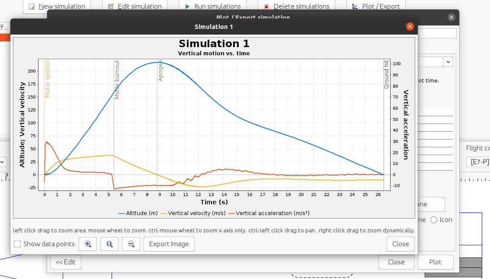

OpenRocket simulation results

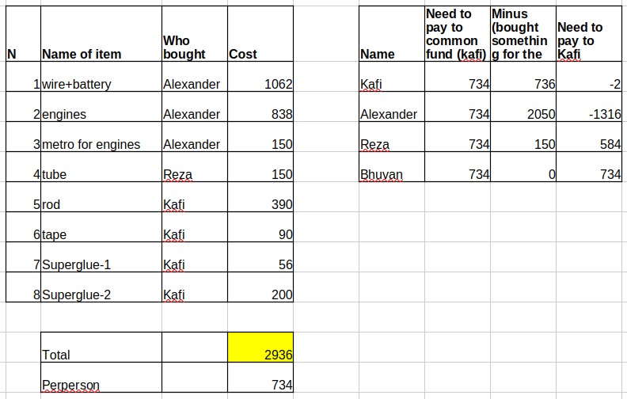

Cost analysis and distribution table

## Love for Rocket 

Love thy rocket more than thy female

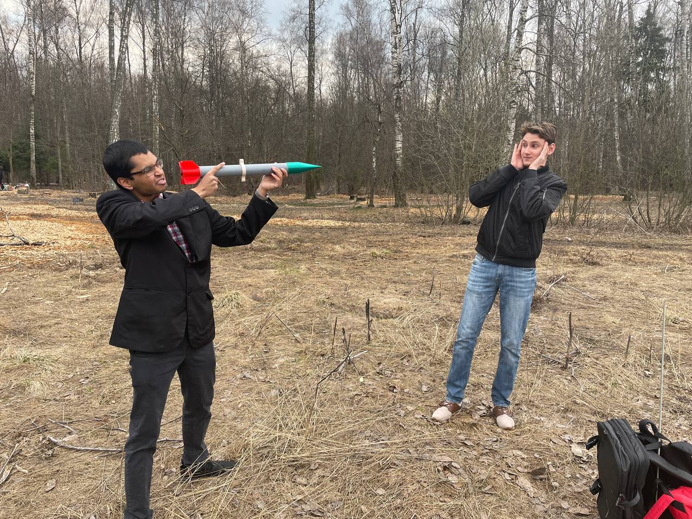

The rocket can be used as a weapon

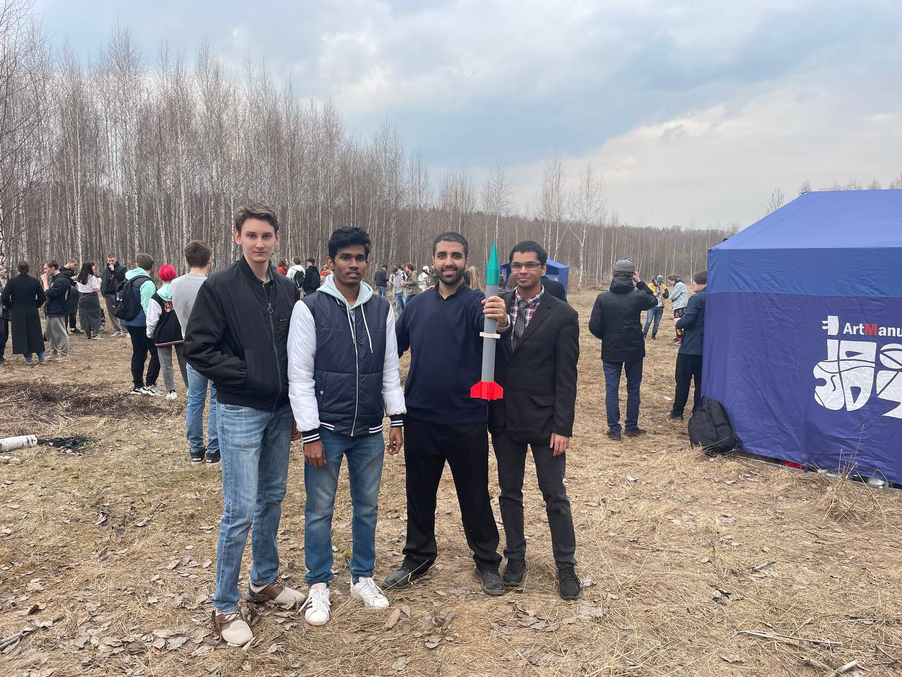

The team holding the rocket before launch

## Launch Pad
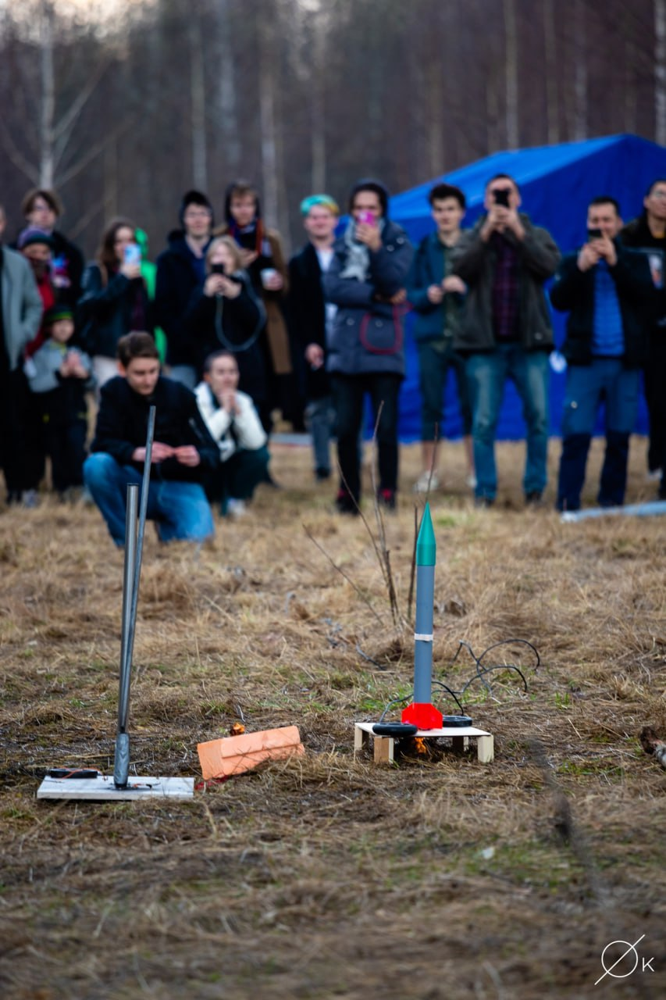

Rocket sitting on launch pad, ignition igniting spring grass

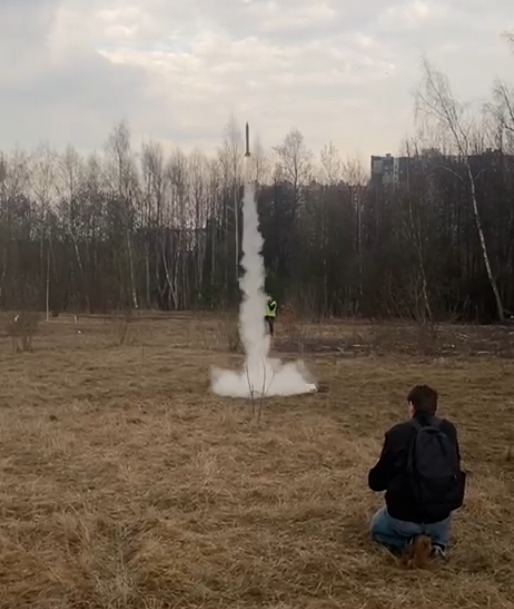

Igniter watching rocket take off, leaving smoke trail

## Recovery

Bhuvan has located and recovered the rocket, ring module has disappeared

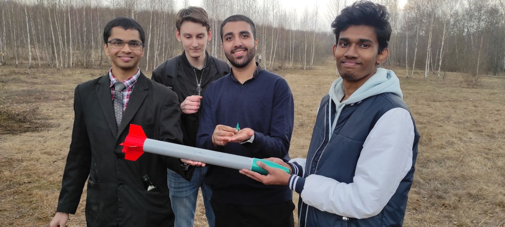

The team examining the recovered rocket with nose fractured during touchdown

Kafi giving speech about launch
